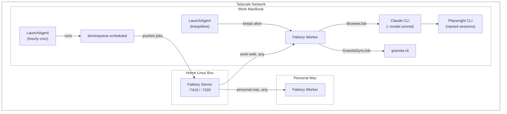

# Union

A distributed job queue for personal automation tasks, powered by [Faktory](https://github.com/contribsys/faktory) and accessible via Tailscale.

*Union brings together your machines, your tasks, and your time.*

## Architecture



### How Jobs Execute

1. **LaunchAgent** runs `bin/enqueue-scheduled` every hour, enqueuing jobs based on time/day
2. **Faktory worker** (also a LaunchAgent) pulls jobs from queues and executes them
3. **Browser jobs** (`BrowserJob` subclasses) shell out to `claude --model sonnet -p` and the prompt instructs Claude to use `playwright-cli` via Bash for browser automation. Each job uses a persistent named Playwright session (e.g., `-s=outlook`) with auth managed by `bin/auth-check`
4. **Non-browser jobs** (`ClaudeJob`, `GranolaSyncJob`) run directly without a browser

## Components

| Directory | Purpose |
|-----------|---------|
| `faktory-server/` | Docker setup for Faktory server (deploy to home server) |
| `workers/` | Ruby workers that process jobs (run on each Mac) |
| `launchagents/` | macOS LaunchAgents for persistence (install manually) |

## Quick Start

### 1. Deploy Faktory Server

Copy `faktory-server/` to your home Linux server and run:

```bash
cp .env.example .env
# Edit .env with your Tailscale IP and a strong password
docker-compose up -d
```

### 2. Set Up Worker on Mac

```bash
cd workers
bundle install

# Create config from template and fill in secrets
cp config.yml.example config.yml
# Edit config.yml with your Faktory URL, Google Calendar creds, etc.

# Test the worker
bundle exec faktory-worker -q work-web -q any -r ./worker.rb
```

### 3. Install LaunchAgents

**You must run these commands yourself** (not Claude) to avoid SentinelOne detection.

```bash
cp launchagents/*.plist ~/Library/LaunchAgents/
launchctl bootstrap gui/$(id -u) ~/Library/LaunchAgents/com.user.faktory-worker.plist
launchctl bootstrap gui/$(id -u) ~/Library/LaunchAgents/com.user.scheduled-jobs.plist
```

### LaunchAgent Management

```bash
# Check status
launchctl print gui/$(id -u)/com.user.faktory-worker

# View logs
tail -f /tmp/faktory-worker.log
tail -f /tmp/scheduled-jobs.log

# Restart process (keeps same plist config)
launchctl kickstart -k gui/$(id -u)/com.user.faktory-worker

# Reload after editing a plist (must bootout + bootstrap to pick up changes)
launchctl bootout gui/$(id -u)/com.user.faktory-worker
launchctl bootstrap gui/$(id -u) ~/Library/LaunchAgents/com.user.faktory-worker.plist
```

**Important**: `kickstart -k` restarts the process but does **not** reload plist changes. After editing a plist, you must `bootout` then `bootstrap` to pick up the new definition.

## Configuration

All secrets and settings live in `workers/config.yml` (gitignored). Copy from the template:

```bash
cp workers/config.yml.example workers/config.yml
```

The Config module loads this at startup for both the worker and the enqueue scripts. It also exports `FAKTORY_URL` and `GCAL_*` env vars so downstream tools (Faktory gem, curl commands) can use them.

## Job Types

| Job | Queue | Requirements | Description |
|-----|-------|--------------|-------------|
| `EmailCleanupJob` | work-web | Playwright session `outlook`, screen unlocked | Auto-archive inbox emails |
| `SlackDmTriageJob` | work-web | Playwright session `slack-{workspace}`, screen unlocked | Triage Slack DMs into Jira tasks |
| `LinkedinDmTriageJob` | work-web | Playwright session `linkedin`, screen unlocked | Triage LinkedIn messages into Jira tasks |
| `CalendarSyncJob` | work-web | Playwright session `outlook-calendar`, screen unlocked | Sync Outlook calendar to Google Calendar |
| `GranolaSyncJob` | any | granola-cli installed | Sync meeting notes to local files |
| `ClaudeJob` | any | Claude CLI | Run arbitrary Claude prompts |
| `SessionHealthJob` | any | playwright-cli | Verify Playwright sessions are authenticated and refresh state files |

## Job Schedule

All scheduling logic lives in `bin/enqueue-scheduled`, triggered hourly by a LaunchAgent. Jobs with `unique_for` deduplication are marked — only the first enqueue within that window actually runs.

| Job | Schedule | Hours | Days |
|-----|----------|-------|------|
| **SessionHealthJob** | every 4h | 0, 4, 8, 12, 16, 20 | every day |
| **GranolaSyncJob** | daily | 6 | every day |
| **CalendarSyncJob** (full) | 2x/week | 4 | Mon, Thu |
| **CalendarSyncJob** (mid) | nightly | 5 | every day |
| **EmailCleanupJob** | every 3h | 6, 9, 12, 15, 18 | weekdays |
| **CalendarSyncJob** (fast) | every 3h | 6, 9, 12, 15, 18 | weekdays |
| **SlackDmTriageJob** | 3x morning | 7, 9, 11 | weekdays |
| **LinkedinDmTriageJob** | 3x morning | 7, 9, 11 | weekdays |

**Weekend:** Only GranolaSyncJob (6am) and SessionHealthJob (every 4h) run. All other jobs are weekday-only.

**Deduplication:** SlackDmTriageJob (`unique_for: 24h`) and LinkedinDmTriageJob (`unique_for: 24h`) are enqueued at 7, 9, and 11 but only the first successful enqueue runs — the others are deduplicated by Faktory.

## Condition-Based Execution

Browser jobs check preconditions before executing:
- **Screen unlocked** — checked via `ioreg` (macOS Quartz API)
- **Playwright session ready** — checked via `playwright-cli list`; if not running, attempts `state-load` from `.auth-state/<name>.json`

If conditions aren't met, the job raises an error and Faktory retries later. Run `bin/auth-check` to authenticate all Playwright sessions.

## Why This Architecture?

- **Tailscale** = Secure access from anywhere without public exposure
- **Faktory** = Battle-tested job queue with web UI, retries, scheduling
- **Queues for routing** = Jobs go to specific machines (work-web, personal-mac, any)
- **Playwright CLI** = Browser jobs use persistent named sessions (`playwright-cli -s=<name>`), no Chrome dependency or single-tenant MCP constraint
- **`claude --model sonnet -p`** = Browser jobs run on Sonnet for cost/token efficiency
- **config.yml** = Single source of truth for secrets, synced manually across machines
- **Manual LaunchAgent install** = Avoids SentinelOne flagging Claude for persistence
